# 🎓 E-Lumo Language Learning Platform
### Designing a Gamified Language-Learning Experience Through Agile Product Development

  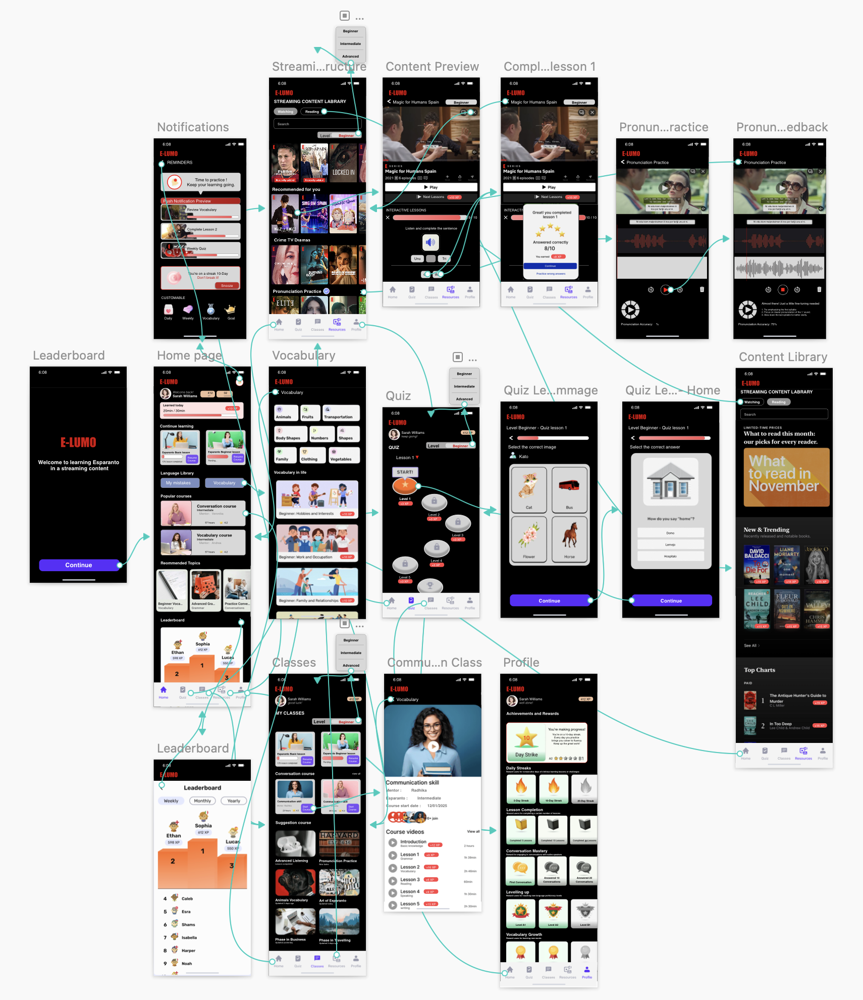

---

## 🚀 What This Project Is About

E-Lumo is a digital language-learning platform designed to make learning more engaging, interactive, and motivating through a combination of:

- gamification  
- structured learning pathways  
- streaming content  
- personalised user experiences  

The product concept was developed using Agile product practices to explore how a modern learning platform could improve user engagement and learning effectiveness.

---

## 🎯 The Opportunity

Traditional language-learning platforms often struggle with:

- low long-term engagement  
- limited personalisation  
- weak motivation for continued learning  
- disconnected learning and entertainment experiences  

E-Lumo was designed to address these challenges by combining education, entertainment, and gamified progress systems into a single digital product experience.

---

## 👤 My Role

**Product Owner / Business Analyst**

I contributed across the product planning and Agile development lifecycle, including:

- defining the product vision and MVP
- conducting user research and persona analysis
- managing backlog prioritisation
- supporting sprint planning and story point estimation
- designing UX flows and prototype structure
- contributing to release planning and Agile reporting

---

## 🧠 Product Vision

E-Lumo was designed as a gamified language-learning platform that helps users learn through interactive content, structured progress tracking, and community-driven engagement.

### Core product goals:
- improve user engagement through gamification
- provide clear progress visibility
- personalise learning pathways
- combine structured lessons with engaging content
- support long-term retention through motivation systems

---

## 👥 User-Centred Design

The product strategy was shaped around two core personas:

### Persona 1: Sarah Williams
A culturally curious learner looking for deeper language immersion, meaningful content, and community connection.

### Persona 2: John Cena
A younger, engagement-driven learner motivated by gamification, instant feedback, and visual progress.

These personas informed:
- feature prioritisation
- UX decisions
- MVP focus
- roadmap direction

### Persona Assets
- 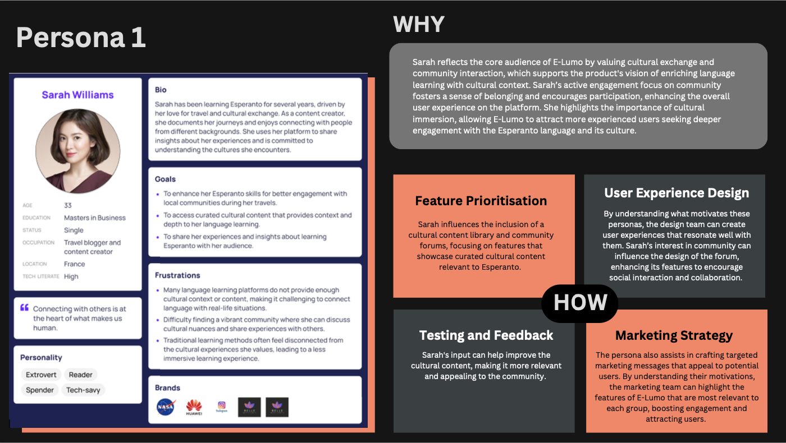
- 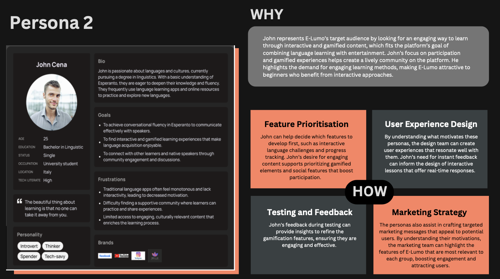

---

## 🧩 MVP Strategy

The MVP focused on features most critical to user engagement and learning continuity.

### Core MVP Features
- Gamification & Engagement
- Progress & Performance Tracking
- Streaming Content Library
- Interactive Lessons
- Notifications & Reminders
- Vocabulary & Pronunciation Practice

These features were selected to deliver the highest user value while remaining feasible within the scope of the first release.

---

## 📌 Backlog & Prioritisation

The project backlog was managed using Agile principles and **MoSCoW prioritisation**, with features categorised into:

- Must Have
- Should Have
- Could Have

The backlog included:
- 20+ epics
- user stories
- acceptance criteria
- story decomposition
- release planning by quarter

### Key Agile metrics
- Total story points: ~372
- Average team velocity: ~19 story points per sprint

### Agile Planning Assets
- 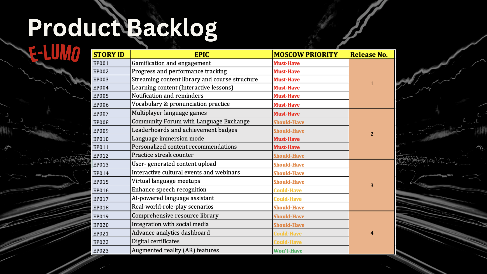
- 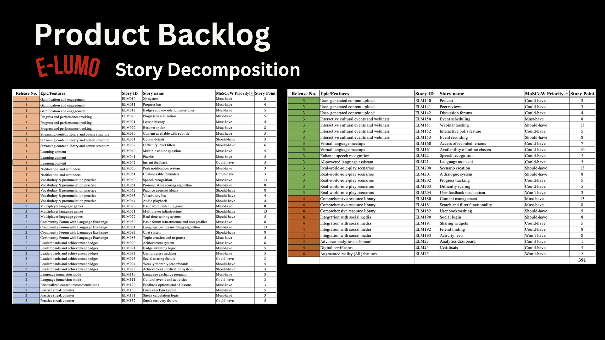
- 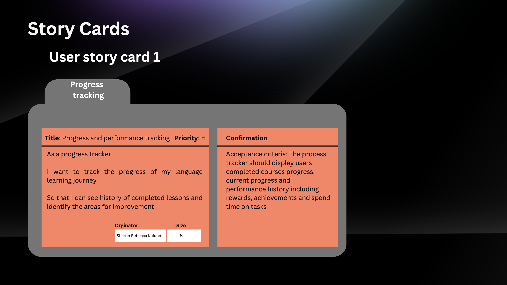
- 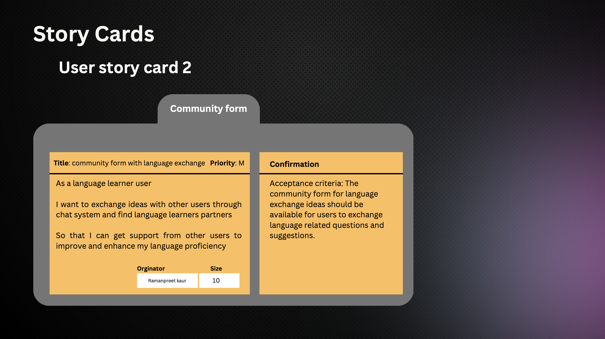
- 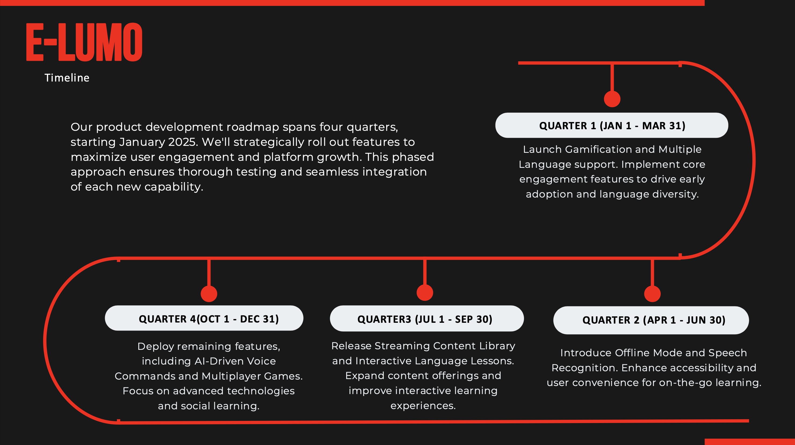
- 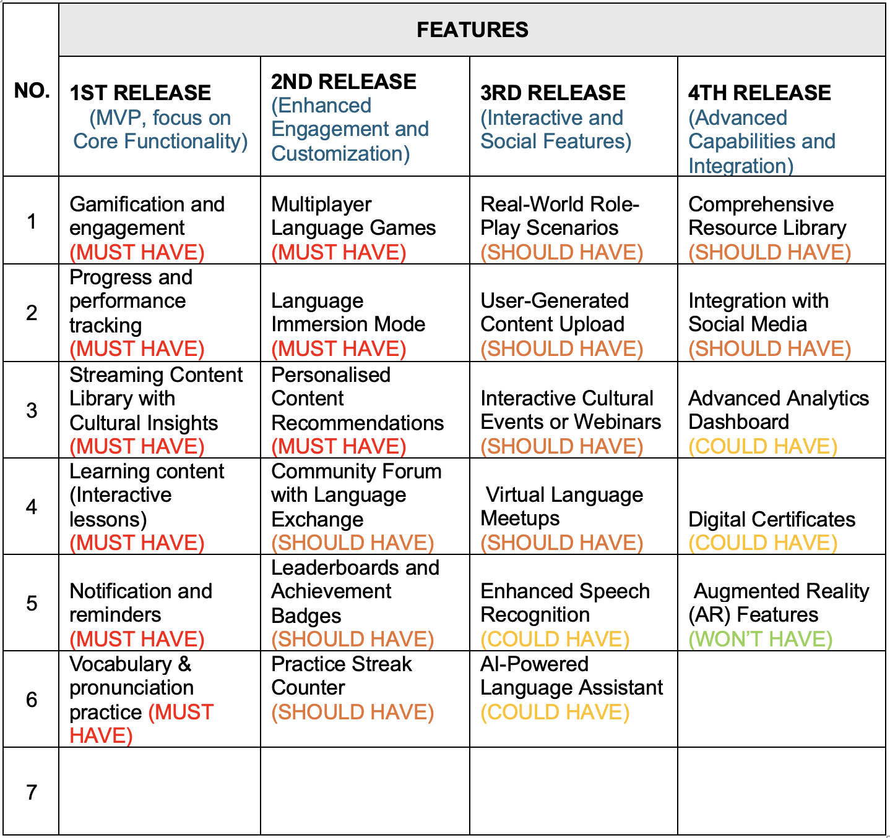
- 
- 

---

## 🔄 Agile Delivery Approach

E-Lumo was planned and structured using Agile product delivery practices, including:

- sprint planning
- backlog refinement
- story point estimation
- release planning
- burndown tracking
- team cadence and reporting

This approach ensured that product development remained iterative, measurable, and aligned with evolving priorities.

### Agile Reporting
- 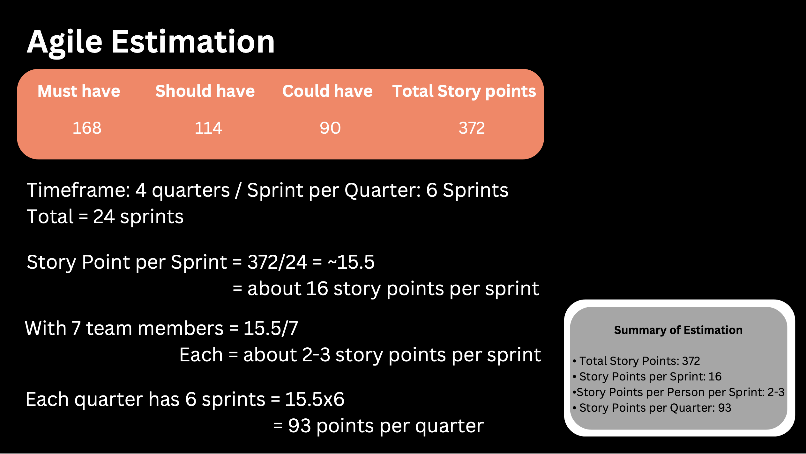
- 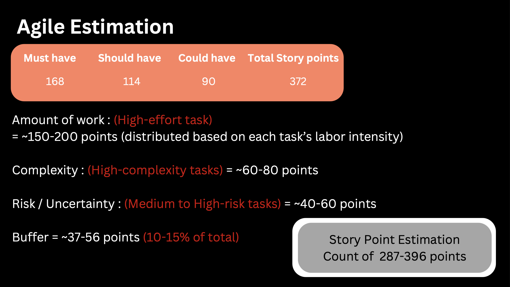
- 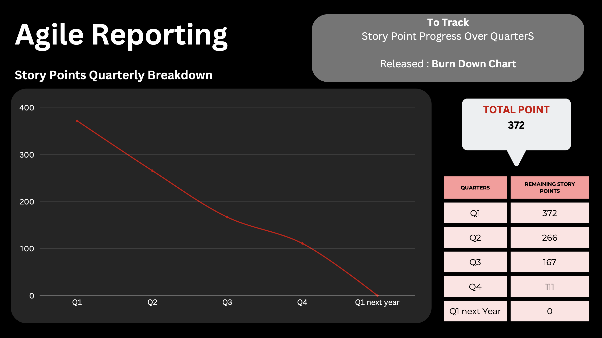
- 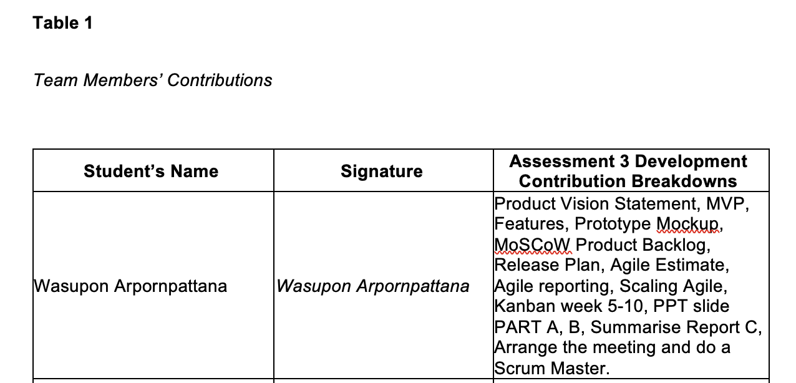

---

## 🎨 UX / Prototype Design

The prototype was designed to create a motivating and intuitive user experience through:

- gamified progress systems
- structured lesson navigation
- personalised recommendations
- visual learning feedback
- achievement-based engagement

### Key Screens
- Home Page
- Quiz Experience
- Vocabulary Page
- Classes Page
- Streaming Content Pages
- Profile / Rewards

### Prototype Screens

  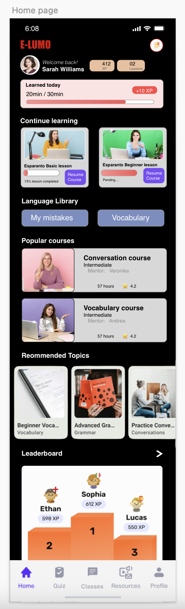

- 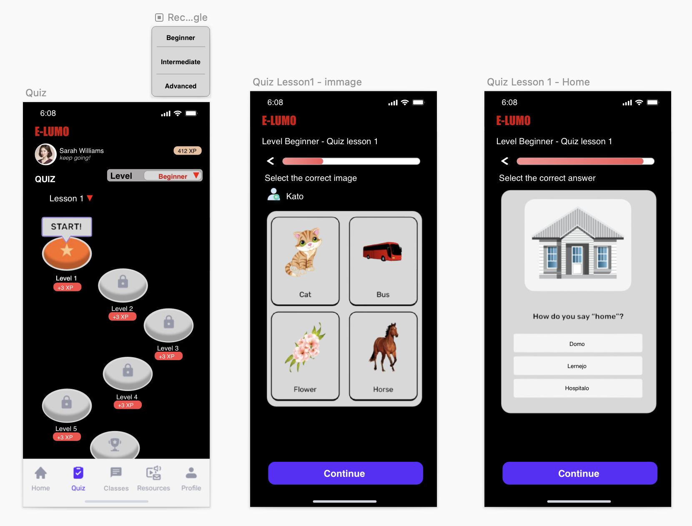
- 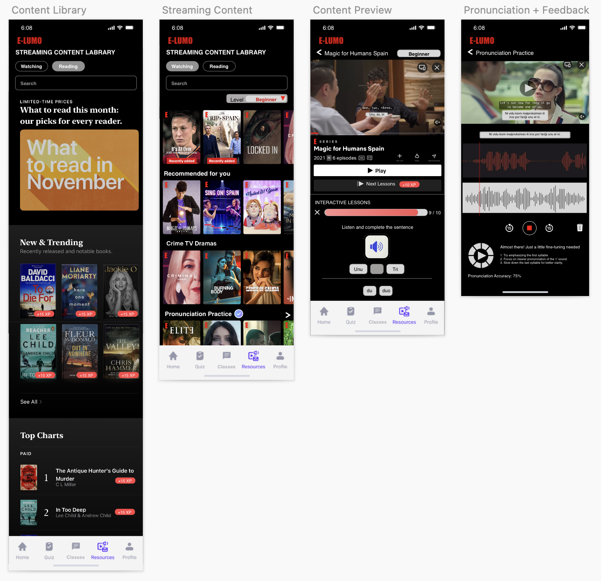

---

## 📈 Outcome

This project demonstrates the ability to:

- define a product vision
- translate user needs into MVP features
- manage an Agile backlog
- apply story point estimation and roadmap planning
- design user-centred product experiences
- communicate product structure clearly through prototype artefacts

E-Lumo reflects a practical example of combining **Product Thinking, Agile Delivery, and Business Analysis** in one project.

---

## 🧠 Key Learnings

Through this project, I strengthened my ability to:

- connect user needs with product decisions
- prioritise features using Agile frameworks
- balance business value with feasibility
- structure delivery through backlog and sprint planning
- use UX design to support product strategy

---

## 🔧 Tools & Methods

- Jira
- Sketch
- Canva
- Trello
- Agile / Scrum
- MoSCoW Prioritisation
- Story Point Estimation
- User Personas
- MVP Planning
- Release Roadmapping

---

## 📄 Supporting Documents

- [Assessment Part A](docs/e-lumo-part-a.pdf)
- [Assessment Part B](docs/e-lumo-part-b.pdf)
- [Assessment Part C](docs/e-lumo-part-c.pdf)

---

## 👤 Author

**Petch Arpornpattana**  
Business Analyst | Product-Oriented Thinker

Focused on translating user needs, business goals, and product strategy into structured digital solutions.
